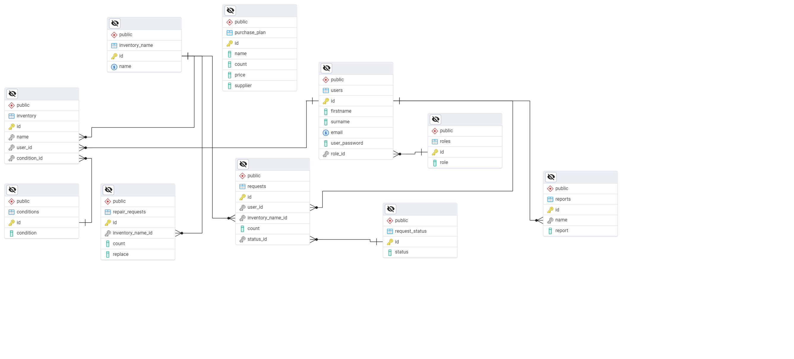

# pre-professional-Olympiad

# Содержание 
- [Краткое описание](#краткое-описание)
- [Инструкция по развертыванию](#интсрукция-по-установке)
- [Ссылка на видеоролик](#ссылка-на-видеоролик)

# Краткое описание
## Цель проекта
Создать сервис для эффективного учета, контроля и распределения спортивного 
инвентаря для улучшения спортивной деятельности учащихся.
## Технологии
- Python
  - Flask
  - psycopg2
- БД
  - PostgreSQL
- HTML/CSS
## Возможности продукта 
1. Для администратора
   - Авторизация
   - Просмотр существующего инвентаря
   - Редактирование/добавление инвенторя
   - Выдача инвентаря пользователям 
   - Создание отчетов по использованию инвентаря
   - Планирование закупки нового инвентаря
2. Для пользователя
   - Авторизация/регистрация
   - Просмотр существующего инвентаря
   - Запрос на получение инвентаря и отслеживание статуса запроса
   - Создание заявки о ремонте или замене инвентаря
3. Возможности для улучшения проекта
    - Добавление новых ролей
    - Поддержка интеграции с внешними системами для автоматизации закупок
    - Создание статистики по использованию инвентаря пользователями

## База данных
При создании веб приложения  была создана бд, ер-диаграмма  которой представлена ниже

# Интсрукция по установке

Для упрощения развертывания веб-приложения был использован докер. Достаточно установить на целевой машине докер, без питона, 
среды разработки и PostgreSQL. Далее в командной строке при открытом докере нужно вбить следующую команду для установки докер-контейнера
```
Команда для установки докер контейнера 
(написать, когда выложу контейнер на докер-хаб)
```       
Далее, в самом докере, необходимо запустить нужный контейнер.  

# Ссылка на видеоролик 
Перейдя по [ссылке](ссылка-на-видеозостинг) можно ознакомиться с демонстрацией работы веб-приложения